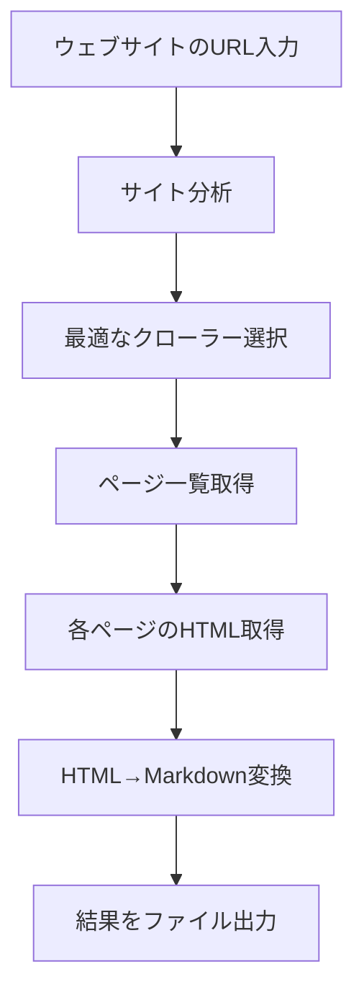

# 🚀 Doc-to-MD プロジェクト 完全解説ガイド

## 📖 このドキュメントについて

このドキュメントは、**プログラミング初心者の方でも理解できるよう**に、Doc-to-MDプロジェクトの全体像、構成、そして今回行った作業について詳しく解説します。

---

## 🎯 Doc-to-MD とは何か？

### 簡単な説明
**Doc-to-MD**は、**ウェブサイトのドキュメントを自動的にMarkdownファイルに変換するツール**です。

### 具体的な使用例
```bash
# 例：Vue.jsの公式ドキュメントをMarkdownに変換
doc-to-md "https://vue.js.org/"

# 結果：すべてのページが一つのMarkdownファイルにまとめられる
# → "unified-output.md" が生成される
```

### なぜ必要なのか？
1. **ドキュメントの保存**: オンラインドキュメントをオフラインで見られるようにする
2. **一元管理**: 複数のページを一つのファイルにまとめる
3. **検索性**: 全文検索が簡単になる
4. **バックアップ**: 重要なドキュメントを保存しておく

---

## 📁 プロジェクト構成の詳細解説

### 全体のディレクトリ構造
```
Doc-to-MD/
├── 📁 src/                    # TypeScriptのソースコード
├── 📁 bin/                    # 実行可能なJavaScriptファイル
├── 📁 dist/                   # コンパイル後のファイル
├── 📁 scripts/                # 開発用スクリプト
├── 📁 .vscode/                # VS Code設定
├── 📁 node_modules/           # 外部ライブラリ
├── 📄 package.json            # プロジェクト設定
├── 📄 tsconfig.json           # TypeScript設定
├── 📄 README.md               # プロジェクト説明
└── 📄 DEVELOPMENT-GUIDE.md    # 開発者向けガイド
```

### 🔍 重要ファイル・フォルダの詳細

#### 1. **📁 src/ フォルダ**
**役割**: TypeScriptで書かれたソースコード
```
src/
├── index.ts                   # 基本クローラー
├── enhanced-index.ts          # エラー処理強化版
├── configurable-index.ts      # 設定可能版
├── performance-index.ts       # 高性能版
├── format-index.ts           # フォーマット強化版
├── unified-index.ts          # 統合版（最新・推奨）
├── *-core.ts                 # 各クローラーの核となる処理
├── config.ts                 # 設定管理
├── site-optimizations.ts     # サイト別最適化
└── *.test.ts                 # テストファイル
```

**初心者向け説明**:
- `.ts` = TypeScript形式のファイル
- TypeScriptはJavaScriptの拡張版で、より安全にコードを書ける
- 各ファイルは異なる「クローラー」を表し、それぞれ特徴がある

#### 2. **📁 bin/ フォルダ**
**役割**: 実際に実行されるJavaScriptファイル
```
bin/
├── doc-to-md.js              # メインコマンド
├── unified.js                # 統合版
├── configurable.js           # 設定可能版
├── performance.js            # 高性能版
├── format.js                 # フォーマット版
├── enhanced.js               # エラー処理版
└── interactive-optimizer.js  # 対話型最適化
```

**初心者向け説明**:
- これらのファイルが実際にコマンドとして実行される
- `npm run build` でsrc/フォルダから自動生成される

#### 3. **📄 package.json**
**役割**: プロジェクトの設定ファイル
```json
{
  "name": "doc-to-md",           // プロジェクト名
  "version": "2.2.0-dev",       // バージョン
  "scripts": {                  // 実行可能なコマンド
    "dev": "node bin/doc-to-md.js",
    "build": "tsc",
    "test": "jest"
  },
  "dependencies": {             // 必要なライブラリ
    "axios": "^1.10.0",         // HTTP通信
    "cheerio": "^1.1.0",        // HTML解析
    "turndown": "^7.2.0"        // HTML→Markdown変換
  }
}
```

**初心者向け説明**:
- このファイルがプロジェクトの「設計図」
- 依存関係（必要なライブラリ）も記載
- `npm install` でここに書かれたライブラリが自動インストールされる

---

## 🛠️ 技術構成の解説

### 使用している主要技術

#### 1. **TypeScript**
- **何のため**: JavaScriptを安全に書くため
- **メリット**: エラーを事前に発見できる
- **ファイル**: `.ts` 拡張子

#### 2. **Node.js**
- **何のため**: サーバーサイドでJavaScriptを実行するため
- **メリット**: Webサイトにアクセスしてデータを取得できる

#### 3. **主要ライブラリ**
```javascript
// HTTP通信（ウェブサイトにアクセス）
import axios from 'axios';

// HTML解析（ウェブページの内容を理解）
import cheerio from 'cheerio';

// HTML→Markdown変換
import TurndownService from 'turndown';

// コマンドライン引数の処理
import yargs from 'yargs';
```

#### 4. **テストフレームワーク**
```javascript
// Jest - テストを実行するためのツール
import { jest } from '@jest/globals';
```

---

## 🎨 Doc-to-MDの動作原理

### 基本的な流れ



### 1. **サイト分析フェーズ**
```typescript
// 例：Vue.jsサイトの分析
const analysis = await analyzeSite("https://vue.js.org/");
// 結果：
// - 推定ページ数: 74
// - 複雑度: moderate
// - 推奨クローラー: configurable
// - 信頼度: 100%
```

### 2. **クローラー選択フェーズ**
```typescript
// 分析結果に基づいて最適なクローラーを選択
if (analysis.pages > 50) {
    // 大規模サイト → performance クローラー
    crawler = new PerformanceCrawler();
} else if (analysis.needsFormatting) {
    // フォーマット重視 → format クローラー
    crawler = new FormatCrawler();
}
```

### 3. **実際の処理フェーズ**
```typescript
// 各ページを順番に処理
for (const url of pageUrls) {
    const html = await fetchPage(url);        // HTML取得
    const markdown = convertToMarkdown(html); // Markdown変換
    allContent += markdown;                   // 結果を蓄積
}
```

---

## 📊 今回の作業内容まとめ

### 🎯 達成したこと

#### 1. **Docsifyサイト対応の実装**
**問題**: Docsifyという技術を使ったサイトが処理できなかった
```bash
# 失敗例
❌ No navigation links found. Please check your --navSelector.
```

**解決**: 特別な処理を追加
```typescript
// src/configurable-core.ts に追加
if (isDocsify) {
    // _sidebar.md ファイルを直接読み込む
    const sidebarContent = await this.makeRequest<string>(sidebarUrl);
    // マークダウンリンクを解析
    const linkRegex = /\[([^\]]+)\]\(([^)]+)\)/g;
    // ...
}
```

**結果**: 
- ✅ Marpitサイト: 8ページ → 100%成功
- ✅ 1,550行のMarkdownファイル生成
- ✅ 6,073語を正常に抽出

#### 2. **開発環境の大幅改善**
**問題**: 開発者がコマンドの使い方で混乱

**解決**: 
- 📄 **DEVELOPMENT-GUIDE.md** - 包括的な開発ガイド
- 🔧 **scripts/dev-setup.sh** - 開発環境自動セットアップ
- ⚙️ **package.json** - 開発用コマンド追加

**新しい使い方**:
```bash
# 開発環境セットアップ
source scripts/dev-setup.sh

# 簡単なコマンド実行
npm run dev -- "https://example.com"
doc-dev "https://example.com"        # エイリアス
doc-analyze "https://example.com"    # 分析のみ
```

#### 3. **VS Code統合**
**追加したファイル**:
- `.vscode/settings.json` - エディタ設定
- `.vscode/tasks.json` - タスク設定

**メリット**:
- Ctrl+Shift+P → "Tasks: Run Task" で簡単実行
- 環境変数自動設定
- TypeScript開発体験向上

### 🔧 技術的な改善点

#### 1. **site-optimizations.ts の拡張**
```typescript
// 新しいサイトパターンを追加
{
  name: 'Docsify Documentation',
  patterns: [/marpit\.marp\.app/, /docsify\.js\.org/],
  optimizations: {
    specialHandling: ['docsify-spa', 'markdown-direct']
  }
}
```

#### 2. **configurable-core.ts の機能拡張**
```typescript
// Docsify検出機能
const isDocsify = html.includes('window.$docsify');

// マークダウン直接処理
const markdownContent = await this.makeRequest<string>(markdownUrl);
```

#### 3. **package.json の充実**
```json
{
  "scripts": {
    "dev": "node bin/doc-to-md.js",
    "dev:unified": "node bin/unified.js",
    "global:install": "npm install -g .",
    "global:uninstall": "npm uninstall -g doc-to-md"
  }
}
```

---

## 🧩 各クローラーの特徴と使い分け

### 1. **Unified Crawler（統合版）**
- **特徴**: 自動的に最適なクローラーを選択
- **使用場面**: 迷った時、初心者向け
- **コマンド**: `npm run dev:unified`

### 2. **Configurable Crawler（設定可能版）**
- **特徴**: 詳細設定が可能、プロキシ対応
- **使用場面**: 企業内サイト、複雑なサイト
- **コマンド**: `npm run dev:configurable`

### 3. **Performance Crawler（高性能版）**
- **特徴**: 大規模サイト用、メモリ効率重視
- **使用場面**: 100ページ以上の大きなサイト
- **コマンド**: `npm run dev:performance`

### 4. **Format Crawler（フォーマット版）**
- **特徴**: 見た目の美しさ重視
- **使用場面**: プレゼン資料、レポート作成
- **コマンド**: `npm run dev:format`

### 5. **Enhanced Crawler（エラー処理版）**
- **特徴**: 不安定なサイト対応
- **使用場面**: 接続が不安定、エラーが多い
- **コマンド**: `npm run dev:enhanced`

---

## 🎯 実際の使用例

### 例1: Vue.js公式ドキュメントの変換
```bash
# 1. 事前分析
npm run dev -- "https://vue.js.org/" --analyze

# 結果例:
# ✅ 推定ページ数: 74
# ✅ 信頼度: 100%
# ✅ 推奨クローラー: configurable

# 2. 実際の変換
npm run dev -- "https://vue.js.org/" --verbose

# 結果:
# ✅ 74ページ処理完了
# ✅ unified-output.md 生成
# ✅ 処理時間: 15秒
```

### 例2: 問題のあるサイトの段階的処理
```bash
# 1. まず分析
npm run dev -- "https://difficult-site.com/" --analyze

# 2. 問題があれば設定を調整
npm run dev:configurable -- "https://difficult-site.com/" --timeout 30000

# 3. それでも駄目ならエラー処理版
npm run dev:enhanced -- "https://difficult-site.com/" --retry 5
```

---

## 📈 今後の展望

### 短期目標（1-2ヶ月）

#### 1. **より多くのサイトタイプに対応**
```typescript
// 予定している追加対応
- GitBook サイト
- Notion 公開ページ
- Confluence サイト
- WordPress ドキュメント
- 企業内Wiki
```

#### 2. **UI/UX改善**
```bash
# 予定している機能
- 対話型セットアップ
- 進捗バーの表示
- より詳細なエラーメッセージ
- カラー出力対応
```

#### 3. **テスト自動化**
```bash
# 予定している改善
- 100サイトでの自動テスト
- 成功率の継続監視
- 性能ベンチマーク
- リグレッションテスト
```

### 中期目標（3-6ヶ月）

#### 1. **GUI版の開発**
```bash
# 予定している機能
- Electron アプリ
- ドラッグ&ドロップ対応
- リアルタイム プレビュー
- 設定の可視化
```

#### 2. **クラウド版の提供**
```bash
# 予定している機能
- Web API 提供
- バッチ処理対応
- スケジュール実行
- 結果の共有機能
```

#### 3. **AI機能の追加**
```typescript
// 予定している機能
- 自動要約生成
- 重要度判定
- 関連記事の発見
- 翻訳機能
```

### 長期目標（6ヶ月以上）

#### 1. **企業向け機能**
```bash
# 予定している機能
- 大規模環境対応
- 認証システム連携
- チーム共有機能
- 監査ログ
```

#### 2. **エコシステム構築**
```bash
# 予定している展開
- プラグインシステム
- コミュニティ投稿機能
- マーケットプレイス
- 開発者API
```

---

## 🎓 学習リソース

### 初心者向け

#### 1. **Node.js基礎**
```bash
# 推奨学習順序
1. Node.js 公式チュートリアル
2. npm の使い方
3. package.json の理解
4. モジュールシステムの理解
```

#### 2. **TypeScript入門**
```bash
# 推奨学習順序
1. TypeScript 公式ハンドブック
2. 型システムの理解
3. インターフェースとクラス
4. 非同期処理（async/await）
```

#### 3. **Web技術**
```bash
# 必要な知識
1. HTML の基本構造
2. CSS セレクター
3. HTTP の基本
4. DOM の理解
```

### 中級者向け

#### 1. **設計パターン**
```typescript
// 学習すべきパターン
- Factory Pattern（クローラー選択）
- Strategy Pattern（処理方法選択）
- Observer Pattern（進捗監視）
- Chain of Responsibility（エラー処理）
```

#### 2. **テスト技法**
```typescript
// 学習すべき技法
- Unit Testing（単体テスト）
- Integration Testing（統合テスト）
- End-to-End Testing（E2Eテスト）
- Test-Driven Development（TDD）
```

---

## 🤝 コントリビューション方法

### 1. **環境構築**
```bash
# 1. リポジトリをクローン
git clone https://github.com/alian-ui/Doc-to-MD.git
cd Doc-to-MD

# 2. 依存関係インストール
npm install

# 3. 開発環境セットアップ
source scripts/dev-setup.sh

# 4. 動作確認
npm run dev -- "https://vue.js.org/" --analyze
```

### 2. **開発フロー**
```bash
# 1. 新しいブランチを作成
git checkout -b feature/new-site-support

# 2. 開発作業
npm run dev -- "https://target-site.com/" --analyze
# コードを修正

# 3. テスト実行
npm test
npm run dev -- "https://target-site.com/" --verbose

# 4. コミット
git add .
git commit -m "feat: add support for new site type"

# 5. プッシュ
git push origin feature/new-site-support

# 6. プルリクエスト作成
```

### 3. **報告・提案**
```bash
# 問題報告
- GitHub Issues で報告
- エラーメッセージを含める
- 対象URLを記載（可能であれば）

# 新機能提案
- 具体的な使用例を示す
- 実装の難易度を考慮
- 他のユーザーにも有益か検討
```

---

## 📞 サポート・質問

### 質問する前に

1. **README.md** を確認
2. **DEVELOPMENT-GUIDE.md** を確認
3. **GitHub Issues** で同じ問題がないか確認

### 質問方法

```bash
# 良い質問の例
❓ 題名: "Notion公開ページでのクロール失敗"
❓ 内容:
- 対象URL: https://notion.so/example
- 使用コマンド: npm run dev -- "URL" --verbose
- エラーメッセージ: [具体的なエラー]
- 期待する動作: [何を期待していたか]
- 環境: macOS 13.0, Node.js 18.0
```

### 連絡先

- **GitHub Issues**: 技術的な問題・バグ報告
- **GitHub Discussions**: 一般的な質問・アイデア
- **開発者**: @alian-ui

---

## 🎉 最後に

このDoc-to-MDプロジェクトは、**Webドキュメントの保存と整理**を簡単にすることを目指しています。

### プロジェクトの価値

1. **時間の節約**: 手作業でのコピー&ペーストが不要
2. **データの保存**: 重要なドキュメントの永続化
3. **検索性の向上**: 全文検索が可能
4. **オフライン対応**: インターネット接続なしでも閲覧可能

### 貢献への感謝

このプロジェクトは、多くの開発者の協力により成り立っています。小さな改善から大きな機能追加まで、すべての貢献を歓迎します。

### 学習の機会

このプロジェクトは、実際の開発現場で使われる技術を学ぶ絶好の機会でもあります。TypeScript、Node.js、テスト、CI/CDなど、モダンな開発技術を実践的に学べます。

**一緒に素晴らしいツールを作っていきましょう！** 🚀

---

*このドキュメントは 2025年7月18日 に作成されました。*
*最新の情報は GitHub リポジトリで確認してください。*
